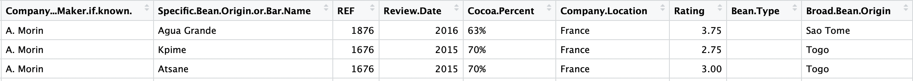
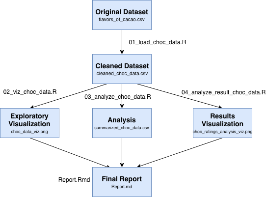

# Chocolate Bar Rating Analysis

## Project Overview

Have you ever wondered where the chocolate beans of your favourite chocolate bar came from, and whether that has an effect on how good it tastes?

To investigate this further, we needed some very delicious chocolate data - we used the [chocolate bar ratings dataset from Kaggle](https://www.kaggle.com/rtatman/chocolate-bar-ratings), which contains ratings by chocolate experts on over 1,795 individual chocolate bars. The dataset includes additional information about the chocolate bars, including where the chocolate beans were grown, cocoa percentage, and bean variety.

Here is a snapshot of first few rows in the dataset:



(A CSV copy of the data from Kaggle can be found in the data folder of this repository.)

Since [Venezuela is one of the largest producers of the Criollo bean, which is considered a delicacy](https://en.wikipedia.org/wiki/Cocoa_bean), we set out to answer the following question using the chococlate bar ratings dataset:

>**Do chocolate bars made from beans grown in Venezuela have a different average rating score compared to beans grown elsewhere?**

## Usage

You can reproduce our analysis with the following steps:

1. Clone this repo, and using the command line, navigate to the root of this project.

2. Run the below commands in the order listed:

```
Rscript src/load_choc_data.R data/flavors_of_cacao.csv data/cleaned_choc_data.csv
Rscript src/viz_choc_data.R data/cleaned_choc_data.csv results/choc_data_viz.png
Rscript src/analyze_choc_data.R data/cleaned_choc_data.csv results/summarized_choc_data.csv
Rscript src/analyze_result_choc_data.R data/cleaned_choc_data.csv results/choc_ratings_analysis_viz.png
Rscript -e "rmarkdown::render('doc/Report.Rmd')"
```

### Usage Flow Chart

The below flowchart visualizes the order the scripts are run as listed in Usage, along with the input file(s) needed and output file(s) produced at each step.



## Dependencies
- R & R libraries:
    - `tidyverse`
    - `rmarkdown`
    - `knitr`
    - `here`
    - `infer`
