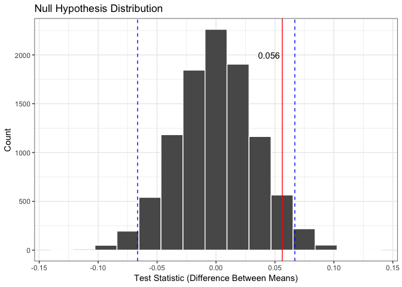

Chocolate Bar Rating Analysis
================

## The data

For this project, we chose a public dataset of chocolate bar ratings.
The data is available from
[Kaggle](https://www.kaggle.com/rtatman/chocolate-bar-ratings) and a
`.csv` copy has been added to the `data` folder in this repository. We
are specifically focusing on 2 columns: Ratings (which are specific
ratings for bars of chocolate that range from 1 to 5, with 1 being
‘Unpleasant’ and 5 being ‘Elite’), and Specific Bean Origin (which is
the specific geo-region of origin for the bar). ‘The database is
narrowly focused on plain dark chocolate with an aim of appreciating the
flavors of the cacao when made into chocolate.’1 71 rows of
data were removed that were missing a location for the bean origin, with
1721 rows remaining.

## The question

Is the average rating for chocolate bars made from beans grown in
Venezuela different from the average rating for chocolate bars made from
beans grown in other parts of the world?

## The statistical summary

In order to answer this question, we conducted a hypothesis test for the
difference between two means. The means are average ratings for
chocolate bars for the two groups (beans grown in Venezuela vs not).

We computed the sample test statistic (`delta_star`), a 95% confidence
interval, and the p-value:

    ## # A tibble: 1 x 4
    ##   delta_star lower_ci upper_ci p_value
    ##        <dbl>    <dbl>    <dbl>   <dbl>
    ## 1     0.0562  -0.0665   0.0669  0.0941

## The plot

We then visualized the test statistic and where it fell in relation to
our confidence interval:

<!-- -->

## The result

Based on a threshold of 0.05, a p-value of 0.09, and visualizing where
our test statistic falls, we fail to reject the null hypothesis, and
conclude that there is not enough evidence to suggest that there is a
difference in the average ratings of chocolate bars with beans grown
from Venezuela versus other regions.

## Critique

Some bars of chocolate were made from beans from more than one location.
We decided to group only those that listed Venezuela alone to be from
Venezuela. However, some bars had a combination of beans from Venezuela
and other countries. We chose to group these into the ‘Other’ category.

A future direction could be to expand the definition of the Venezuela
category to include bars that have beans that are from Venezuela as well
as other regions, rather than excluding them from this group.
Alternatively, we could create a third group which is beans grown from a
combination of locations that do include Venezuela.

**Additional References**

1: <https://www.kaggle.com/rtatman/chocolate-bar-ratings/home>
