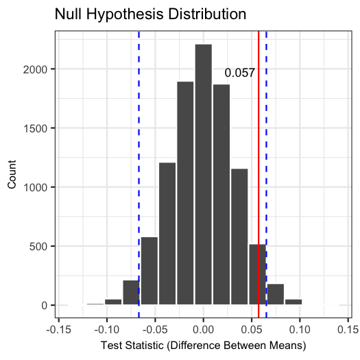

Chocolate Bar Rating Analysis Report
================
Rachel K. Riggs and Carrie Cheung
<br>23 November, 2018

Data
----

For this project, we chose a public data set of chocolate bar ratings. The data is available from [Kaggle](https://www.kaggle.com/rtatman/chocolate-bar-ratings) and a .csv copy has also been added to the `data` folder of this repository.

The data set contains ratings by chocolate experts on over 1,795 individual chocolate bars. According to Kaggle's description, "\[t\]he database is narrowly focused on plain dark chocolate with an aim of appreciating the flavors of the cacao when made into chocolate."<sup>1</sup> Each row presents information about a single chocolate bar. The first few rows of the original data set are shown here:

``` r
head(data, 3)
```

    ##   X Company...Maker.if.known. Specific.Bean.Origin.or.Bar.Name  REF
    ## 1 1                  A. Morin                      Agua Grande 1876
    ## 2 2                  A. Morin                            Kpime 1676
    ## 3 3                  A. Morin                           Atsane 1676
    ##   Review.Date Cocoa.Percent Company.Location Rating Bean.Type
    ## 1        2016           63%           France   3.75          
    ## 2        2015           70%           France   2.75          
    ## 3        2015           70%           France   3.00          
    ##   Broad.Bean.Origin
    ## 1          Sao Tome
    ## 2              Togo
    ## 3              Togo

Although the data includes additional information about the chocolate bars, including where the chocolate beans were grown, cocoa percentage, and bean variety, we are specifically focusing on 2 columns for this analysis:

-   "Ratings" (which are specific ratings for bars of chocolate that range from 1 to 5, with 1 being 'Unpleasant' and 5 being 'Elite'), and:

-   "Broad Bean Origin" (which is the broad geo-region of origin for the bean, typically a country).

71 rows were removed that were missing a location for the bean origin, with 1721 rows remaining.

Question
--------

Since Venezuela is one of the largest producers of the Criollo cocoa bean, which is considered a fine delicacy<sup>2</sup>, we put this to the test by setting out to answer the following question using this dataset:

**Is the average rating for chocolate bars made with beans grown in Venezuela different from the average rating for chocolate bars made from beans grown in other parts of the world?**

Statistical Analysis Summary
----------------------------

To answer this question, we re-formulated our question into the following hypotheses:

> H<sub>0</sub>: There is no difference in the average rating of chocolate bars made with beans grown in Venezuela and chocolate bars made with beans grown in other parts of the world.
>
> H<sub>A</sub>: There is a difference in the average rating of chocolate bars made with beans grown in Venezuela and chocolate bars made with beans grown in other parts of the world.

A two-sample hypothesis test was conducted where the test statistic is the difference between two means. The means in this case are the average rating for chocolate bars made with beans grown in Venezuela and the average rating for chocolate bars made with beans grown elsewhere. We used simulation to generate a sampling distribution of the test statistic under the null hypothesis model.

We also computed the sample test statistic (`delta_star`), a 95% confidence interval, and the p-value:

    ##   delta_star    lower_ci   upper_ci p_value
    ## 1 0.05620965 -0.06652909 0.06688259  0.0982

The null hypothesis distribution is visualized below as a histogram overlaid with the sample test statistic in red to show where it fell in relation to our confidence interval:



Results
-------

From the plot, we can see that it is not unlikely to obtain a test statistic as exteme as the one observed in our sample data under the null hypothesis. In addition, based on an alpha threshold set at 0.05 and a calculated p-value of 0.0941, we fail to reject the null hypothesis.

In this analysis, we conclude that there is not enough evidence to suggest that there is a difference in the average ratings of chocolate bars made with beans grown in Venezuela versus other regions.

Critique
--------

Some chocolate bars were made with beans from more than one location (e.g. Venezuela and Java). We grouped only those that listed Venezuela alone as being from Venezuela, and decided to categorize the more ambiguous case of chocolate bars made with a combination of beans grown in both Venezuela and other countries into the 'Other' category

A future direction could be to expand the definition of the Venezuela category to include bars made with beans from Venezuela as well as other regions, rather than excluding them from this group. Alternatively, we could create a third group, which would be chocolate bars madewith beans grown from a combination of locations that do include Venezuela.

**Additional References**

1: <https://www.kaggle.com/rtatman/chocolate-bar-ratings/home>

2: <https://en.wikipedia.org/wiki/Cocoa_bean>
